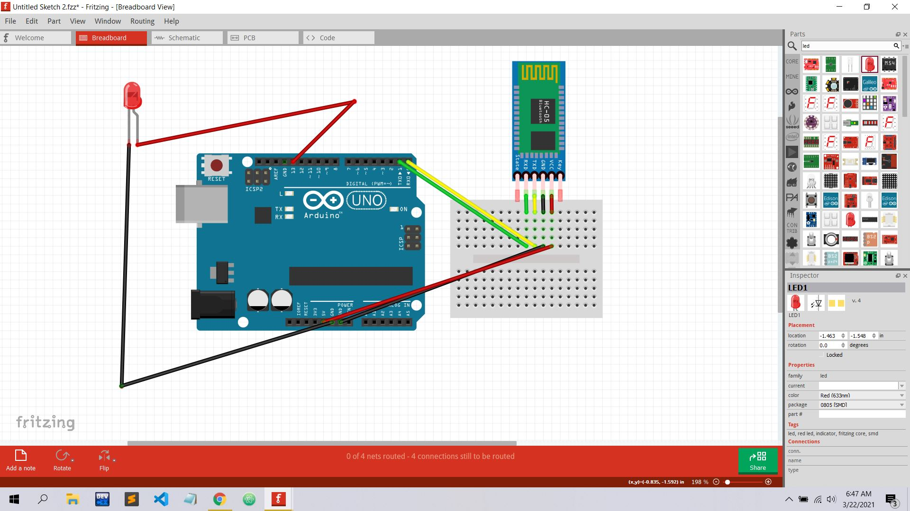

# PyQt5-With-HC-05
A GUI App developed in PyQt5 to work with Arduino and Bluetooth Module (HC-05).
Screen Shot:

Information:
- Programming Language: Python
- Framework: PyQt5

Features:
- Shortcut Key Implemented to turn on/off LED (W= On, E= Off) 
- Serial Communication Based  
- It was a demo (Not all the functions were implemented)

Debug and Possible Problems:
- Before running the software, install pyserial and pyqt5 and connect HC-05 with your laptop/computer .
  python -m pip install pyserial
  python -m pip install pyqt5 
- Check all connections

Run App:
 python main.py
